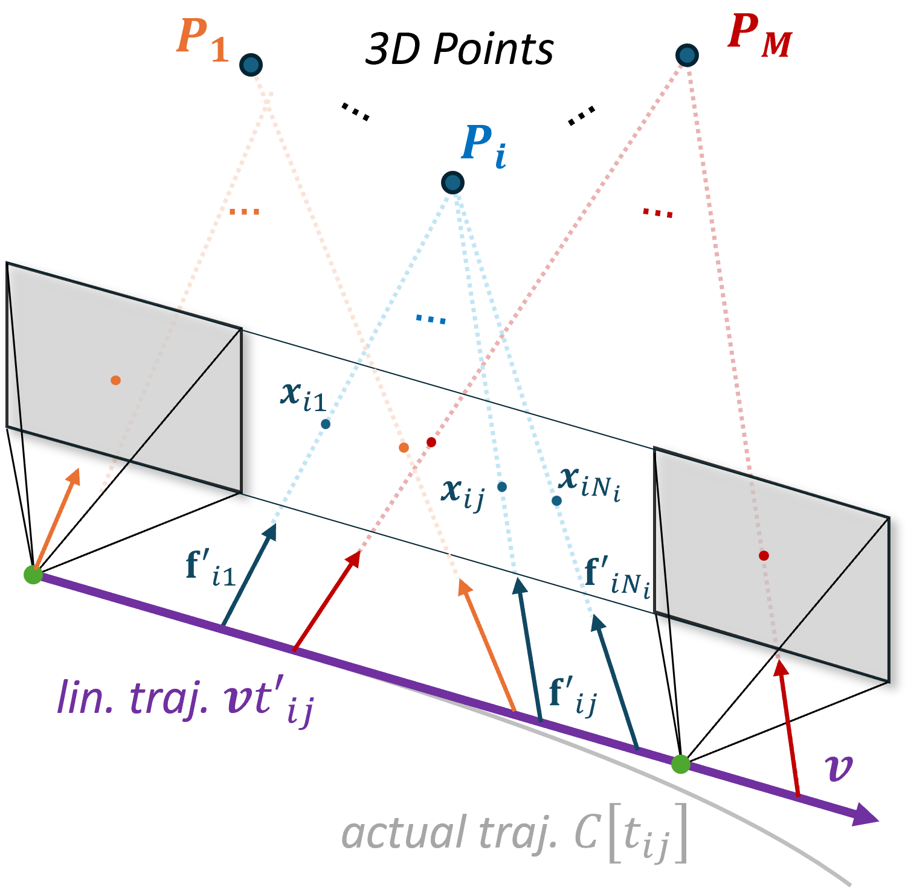

# A Linear N-Point Solver for Structure and Motion from Asynchronous Tracks (ICCV 2025 Highlight)

  
  
  
  

<strong>Hang Su1, Yunlong Feng1, Daniel Gehrig2, Panfeng Jiang1, Ling Gao3, Xavier Lagorce1, Laurent Kneip1</strong>

1ShanghaiTech University &nbsp;&nbsp;&nbsp; 2University of Pennsylvania &nbsp;&nbsp;&nbsp; 3Amap, Alibaba Group

---

> **Abstract**
> *Structure and continuous motion estimation from point correspondences is a fundamental problem in computer vision that has been powered by well-known algorithms such as the familiar 5-point or 8-point algorithm. However, despite their acclaim, these algorithms are limited to processing point correspondences originating from a pair of views each one representing an instantaneous capture of the scene. Yet, in the case of rolling shutter cameras, or more recently, event cameras, this synchronization breaks down. In this work, we present a unified approach for structure and linear motion estimation from 2D point correspondences with arbitrary timestamps, from an arbitrary set of views. By formulating the problem in terms of first-order dynamics and leveraging a constant velocity motion model, we derive a novel, linear point incidence relation allowing for the efficient recovery of both linear velocity and 3D points with predictable degeneracies and solution multiplicities. Owing to its general formulation, it can handle correspondences from a wide range of sensing modalities such as global shutter, rolling shutter, and event cameras, and can even combine correspondences from different collocated sensors. We validate the effectiveness of our solver on both simulated and real-world data, where we show consistent improvement across all modalities when compared to recent approaches. We believe our work opens the door to efficient structure and motion estimation from asynchronous data.*

  
   
  <em>A linear N-point solver for recovering 3D points and the velocity of a camera undergoing quasi-linear motion, given a set of timestamped observations</em>

